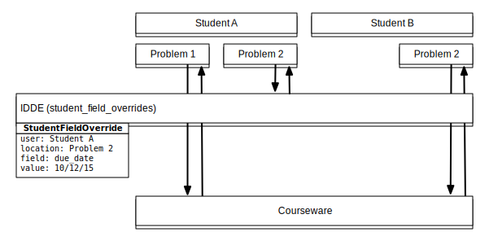
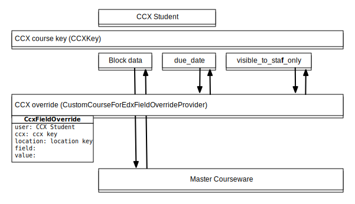

class: title, center, middle

# IDDE, CCX, Overrides and Custom Keys
## 2 advanced features <br> and their architecture


### Peter Pinch <br>  open edX lightning talk, 10/12/15


???

Hi. I'm Peter Pinch, Associate Director of Engineering for the Office of 
Digital Learning at MIT. I've been working edX for just about 3 years now

I'm going to try to introduce two features that we've been working on at MIT,
as well as two pieces of edX technical architecture that makes them work. 

All in 10 minutes.

We'll see how this goes. 

---

class: big_bullets 

# Individual Due Date Extensions (IDDE)

- allows instructor to change due date on one problem for one student
- site feature: uses feature flag

```python
if FEATURES.get('INDIVIDUAL_DUE_DATES'):
    FIELD_OVERRIDE_PROVIDERS += (
        'courseware.student_field_overrides.IndividualStudentOverrideProvider',
    )
```

???

When you set the feature flag, it adds this field override provider to the 
platform. 

This is actually a pretty generic field override "student field overrides" but
the feature flag also turns on a tab in the instructor dashboard.

[change tabs to demo]

And the instructor can choose the user, location and date

---

# Custom Courses on edX (CCX)

- light-weight course reuse
- CCX "coach" can set dates, remove sections
    - can enroll students 
    - can't change course content

```python
if FEATURES.get('CUSTOM_COURSES_EDX'):
    INSTALLED_APPS += ('ccx',)
    FIELD_OVERRIDE_PROVIDERS += (
        'ccx.overrides.CustomCoursesForEdxOverrideProvider',
    )
```

<p style="font-size: small">
	Docs at 
	http://edx.readthedocs.org/projects/edx-installing-configuring-and-running/en/latest/configuration/enable_ccx.html
</p>

??? 

Unfortunately, I don't have time to do a full demo of CCX here now, but we have a screencast
you can watch. 

Here's the lightning version: [change tabs to demo]

It's both a site feature and a course advanced feature. 

It's more complex than IDDE so it adds an app as well as an override. 

---

class: big_bullets 

# Overrides for XBlock fields

### What do these features have in common? 

### We want to modify some XBlock fields for some users. 
	
```python
if FEATURES.get('INDIVIDUAL_DUE_DATES'):
    FIELD_OVERRIDE_PROVIDERS += (
        'courseware.student_field_overrides.IndividualStudentOverrideProvider',
    )
```

```python
if FEATURES.get('CUSTOM_COURSES_EDX'):
    INSTALLED_APPS += ('ccx',)
    FIELD_OVERRIDE_PROVIDERS += (
        'ccx.overrides.CustomCoursesForEdxOverrideProvider',
    )
```


---

class: big_bullets 

# IDDE Overrides



---

# CCX Overrides



---

# Thank You!

- Ike Chuang came up with the acronyms
- Chris Rossi (Jazkarta) wrote IDDE (twice) 
- Cale Pennington dreamed up overrides, and then actually made them work
- Jazkarta (Chris Rossi, Carlos de la Guardia and Cris Ewing) wrote CCX
- Dave Ormsbee persuaded us to create custom CCX keys
- edX Engineering 
- MIT ODL Engineering